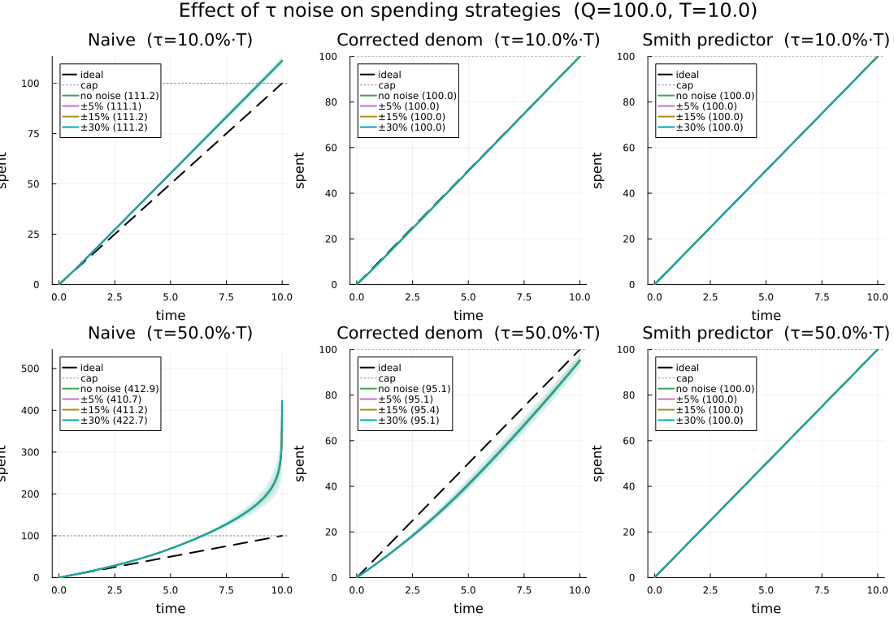

# DDEExamples

A Julia package with worked examples of **Delay Differential Equations (DDEs)** solved with [DifferentialEquations.jl](https://docs.sciml.ai/DiffEqDocs/).

Each example pairs a real-world motivation with a runnable solver function and a comparison against the zero-delay (ODE) limit.  Detailed results and explanations are in [RESULTS.md](RESULTS.md).

## Examples

| # | Name | Equation | Key behavior |
|---|------|----------|-------------|
| 1 | Mackey-Glass | `du/dt = β u(t-τ)/(1+u(t-τ)ⁿ) - γ u` | Deterministic chaos |
| 2 | Delayed logistic growth | `du/dt = r u(t) (1 - u(t-τ)/K)` | Boom-and-bust oscillations |
| 3 | Two-delay system | `du/dt = -a u(t-τ₁) - b u(t-τ₂)` | Damped oscillations |
| 4 | Random delay logistic | Same as #2, τ ~ Uniform[τ_min, τ_max] | Monte Carlo ensemble |
| 5 | Budget spending with delay | `dB/dt = -B(t-τ)/(T-t)` | Overspend from stale information |

Example 5 also includes two corrective strategies:

- **Corrected denominator** — `dB/dt = -B(t-τ)/(T-t+τ)`, a one-line fix that works well for small delays
- **Smith predictor** — reconstructs the true current balance from the delayed observation and cumulative spend history; achieves perfect pacing at any delay

### Noise sensitivity

`demo_budget_delay_with_noise` compares all three strategies across multiple τ noise levels (2×3 grid: two delay values × three strategies):



| Strategy | τ = 10%·T | τ = 50%·T | Noise sensitivity |
|----------|-----------|-----------|-------------------|
| Naive | 111% spent | 413% spent | Low bias change, moderate spread |
| Corrected denom | 100% | 95% (under-spends) | Bias dominates, noise negligible |
| Smith predictor | 100% | 100% | Immune — all curves overlap |

## Installation

```julia
julia --project=.
```

```julia
using Pkg
Pkg.instantiate()
```

## Quick start

```julia
using DDEExamples

# Run all examples and save dde_examples.png
DDEExamples.demo()

# Compare DDEs with their zero-delay (ODE) counterparts
DDEExamples.demo_zero_delay()

# Budget spending strategies under information delay
demo_budget_delay()                          # default: 5%, 10%, 50% of T
demo_budget_delay(delays = [1.0, 2.0, 3.0]) # custom delays
demo_budget_delay(tau_noise = 0.03)          # add ±3% noise to τ

# Noise sensitivity: compare strategies across noise levels (saves budget_delay_noise.png)
demo_budget_delay_with_noise()                              # default: τ = 10% and 50% of T
demo_budget_delay_with_noise(delays = [0.1, 0.3, 0.5] .* 10.0)  # custom delays
demo_budget_delay_with_noise(noise_levels = [0.0, 0.1, 0.5])     # custom noise levels
```

### Solve individually

```julia
sol = solve_mackey_glass(τ = 4.0)        # chaotic Mackey-Glass
sol = solve_logistic_dde(τ = 5.0)        # boom-and-bust logistic
sol = solve_two_delay(τ₁ = 1.0, τ₂ = 3.0)
sim = solve_random_delay(trajectories = 50)  # ensemble solution

sol = solve_budget_delay(Q = 100.0, T = 10.0, τ = 1.5)          # naive
sol = solve_budget_corrected_denom(Q = 100.0, T = 10.0, τ = 1.5) # corrected
sol = solve_budget_smith(Q = 100.0, T = 10.0, τ = 1.5)           # Smith predictor
```

All solvers return a `DifferentialEquations.jl` solution object:

```julia
sol.t          # time points
sol[1, :]      # state variable values
sol(3.7)       # interpolate at any time
```

## Solver

All examples use `MethodOfSteps(Tsit5())` — the standard Method of Steps wrapping a 5th-order adaptive Runge-Kutta solver.

## Dependencies

- [DelayDiffEq.jl](https://github.com/SciML/DelayDiffEq.jl)
- [DifferentialEquations.jl](https://github.com/SciML/DifferentialEquations.jl)
- [Plots.jl](https://github.com/JuliaPlots/Plots.jl)
- [Statistics](https://docs.julialang.org/en/v1/stdlib/Statistics/) (stdlib)
