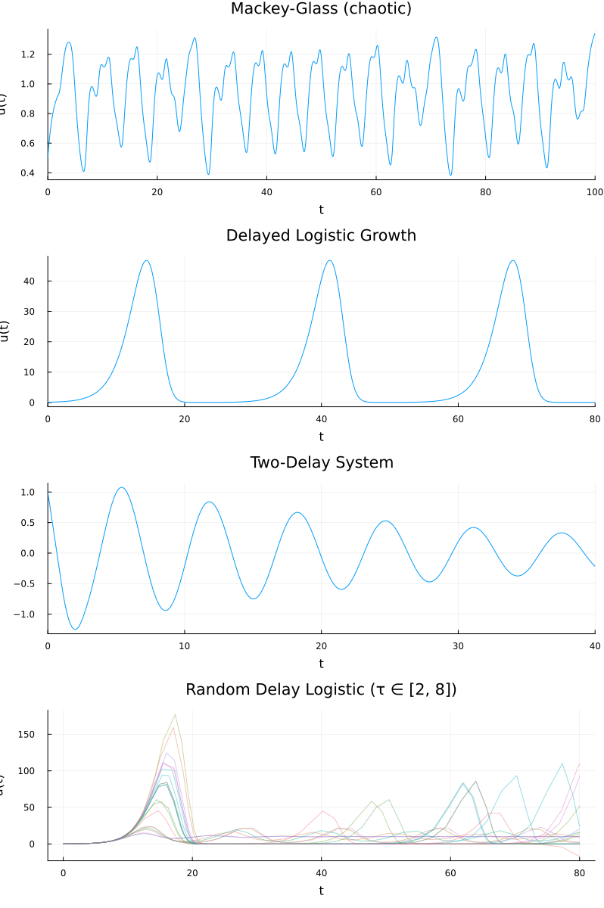
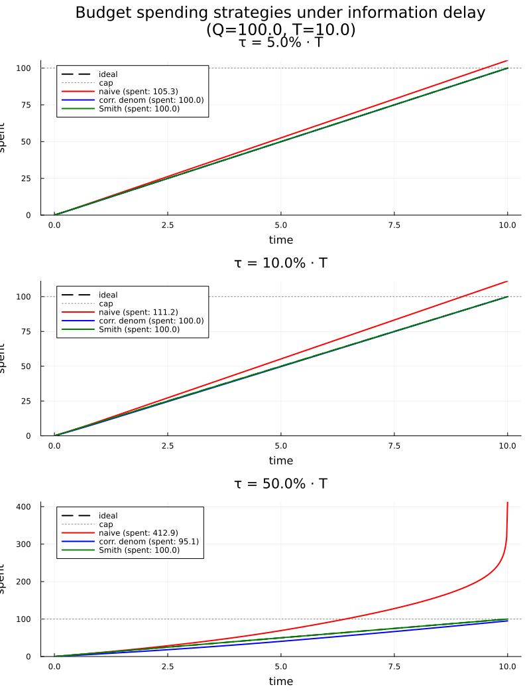
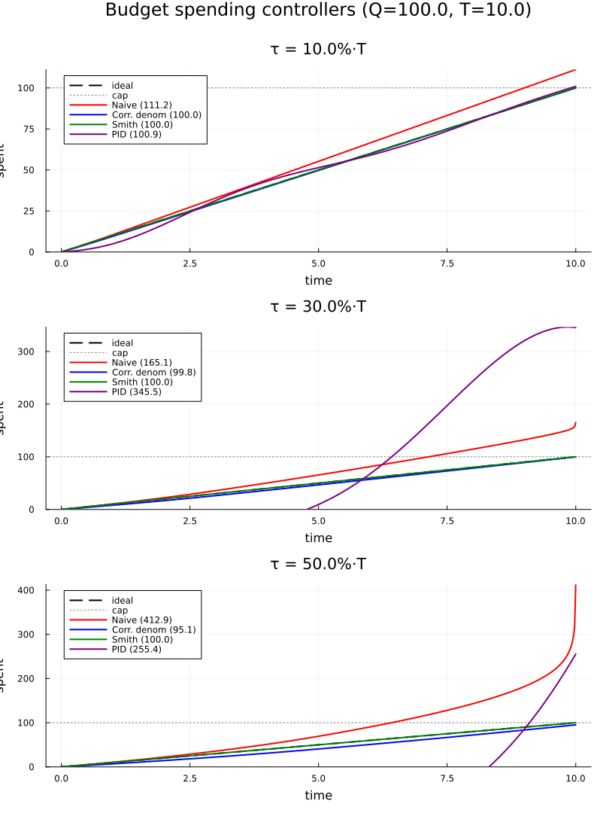
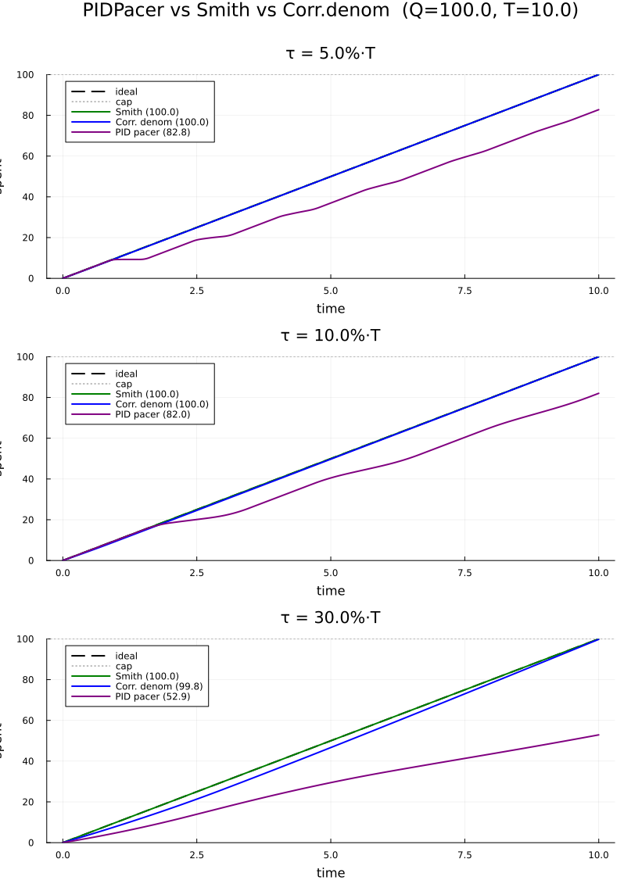
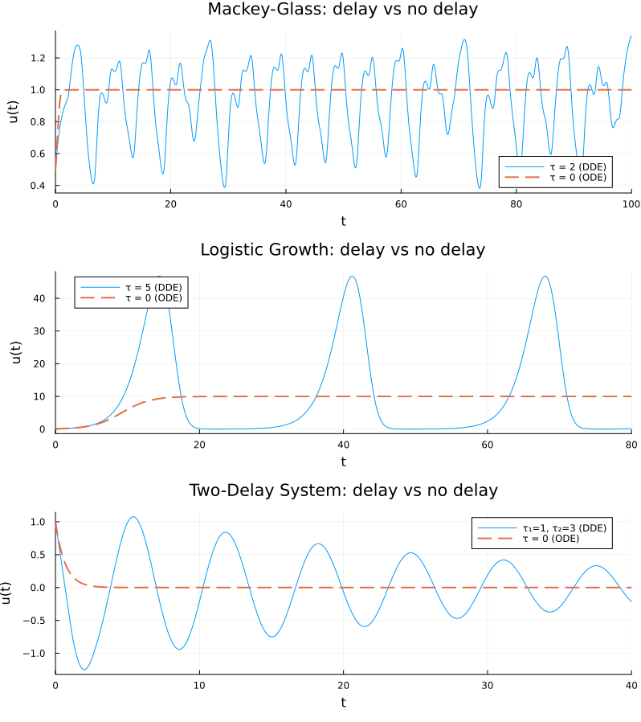

# DDEExamples — Results and Explanations

## What is a Delay Differential Equation?

An ordinary differential equation (ODE) defines the derivative of a state
variable in terms of its *current* value: du/dt = f(u(t), t).  A **delay
differential equation** (DDE) also depends on the state at some earlier time:

    du/dt = f(u(t), u(t - τ), t)

The delay τ introduces memory into the system.  Because the future depends on
the past — not just the present — DDEs can produce oscillations, limit cycles,
and chaos even in scalar (one-variable) equations, behaviors that require at
least two or three variables in an ODE system.

All four examples below are solved with `MethodOfSteps(Tsit5())`, the
standard approach in Julia's DifferentialEquations ecosystem.  `MethodOfSteps`
wraps an ODE solver (here Tsit5, an adaptive 5th-order Runge-Kutta method)
and extends it to handle the delayed terms by carefully tracking
discontinuities that propagate forward from the initial time.



---

## 1. Mackey-Glass Equation

### Equation

    du/dt = β u(t-τ) / (1 + u(t-τ)^n) - γ u(t)

### Default parameters

| Parameter | Value | Meaning |
|-----------|-------|---------|
| β         | 2.0   | Maximum production rate |
| γ         | 1.0   | Decay rate |
| n         | 9.65  | Hill coefficient (nonlinearity) |
| τ         | 2.0   | Delay (time for feedback to act) |
| u₀        | 0.5   | Initial condition |

### Background

Proposed by Mackey and Glass (1977) as a model for the regulation of white
blood cell (neutrophil) production.  The delayed term
β u(t-τ) / (1 + u(t-τ)^n) represents a saturating production rate that
depends on the cell concentration τ time units earlier (the maturation time
of progenitor cells in bone marrow).  The linear term −γ u(t) models natural
cell decay.

### What the plot shows

The solution oscillates irregularly between roughly 0.4 and 1.3.  There is no
visible periodicity — the oscillation amplitude and timing vary from cycle to
cycle.  This is **deterministic chaos**: the trajectory is bounded but never
repeats.

The high Hill coefficient n ≈ 9.65 makes the production term act almost like a
switch — it is large when u(t-τ) is below a threshold and drops sharply above
it.  This sharp nonlinearity, combined with the delay, drives chaotic
oscillations.  With a smaller delay (τ < 1) the system settles to a stable
equilibrium; with τ between roughly 1 and 2 it produces periodic limit cycles;
above τ ≈ 2 the dynamics become chaotic.

### Try it yourself

```julia
# Stable equilibrium
solve_mackey_glass(τ = 0.5)

# Periodic limit cycle
solve_mackey_glass(τ = 1.5)

# Stronger chaos
solve_mackey_glass(τ = 4.0)
```

---

## 2. Delayed Logistic Growth

### Equation

    du/dt = r u(t) (1 - u(t-τ) / K)

### Default parameters

| Parameter | Value | Meaning |
|-----------|-------|---------|
| r         | 0.5   | Intrinsic growth rate |
| K         | 10.0  | Carrying capacity |
| τ         | 5.0   | Delay in density feedback |
| u₀        | 0.1   | Initial population |

### Background

The classic logistic equation du/dt = r u (1 - u/K) describes population
growth with immediate density-dependent feedback: as the population approaches
the carrying capacity K, growth slows to zero.  In reality, the effect of
crowding is not instantaneous — there can be a maturation delay, a gestation
period, or a lag in resource depletion.

Replacing u(t) with u(t-τ) in the density feedback term introduces this lag.
The population reacts to how crowded it was τ time units ago, not how crowded
it is now.

### What the plot shows

The solution exhibits sharp periodic pulses.  The population grows rapidly
(spikes to ~45, far above the carrying capacity K = 10), then crashes back
nearly to zero, stays quiescent for a while, and then spikes again.  The
inter-pulse interval is approximately 25-30 time units.

This "boom-and-bust" cycle is a direct consequence of the delay.  The
population overshoots because, by the time the inhibitory feedback from high
density reaches the growth term, the population has already grown far past K.
The crash follows because the term (1 - u(t-τ)/K) becomes strongly negative
when u(t-τ) is large, driving an exponential collapse.  The long quiet phase
between pulses corresponds to the population slowly recovering from very small
values.

With no delay (τ = 0), the solution would simply grow monotonically to K = 10
and stay there — a smooth sigmoid.

### Try it yourself

```julia
# No delay — smooth logistic curve to K
solve_logistic_dde(τ = 0.1)

# Moderate delay — damped oscillations
solve_logistic_dde(τ = 2.0)

# Large delay — violent oscillations
solve_logistic_dde(τ = 8.0, r = 1.0)
```

---

## 3. Two-Delay System

### Equation

    du/dt = -a u(t-τ₁) - b u(t-τ₂)

### Default parameters

| Parameter | Value | Meaning |
|-----------|-------|---------|
| a         | 1.0   | Coefficient for first delay term |
| b         | 0.5   | Coefficient for second delay term |
| τ₁        | 1.0   | First (short) delay |
| τ₂        | 3.0   | Second (long) delay |
| u₀        | 1.0   | Initial condition |

### Background

This is a linear DDE with two distinct delays.  Linear DDEs arise frequently
as the linearization of nonlinear models around an equilibrium, so their
stability properties are of both theoretical and practical interest.  Despite
being linear, the presence of two incommensurate delays makes the
characteristic equation transcendental (it involves two exponential terms),
and the interplay between the delays can produce complex oscillatory dynamics.

### What the plot shows

The solution oscillates around zero with slowly decreasing amplitude.  The
envelope of the oscillations shrinks from about 1.0 at t = 0 to roughly 0.3
by t = 40.  The oscillation is not purely sinusoidal — the waveform shows a
slight asymmetry and beating pattern due to the two delays contributing
different natural frequencies.

The system is **stable** (the oscillations decay) because the combined feedback
strength (a + b = 1.5) is not large enough relative to the delays to push the
characteristic roots into the right half-plane.  Increasing the coefficients or
the delays would eventually destabilize the system.

### Try it yourself

```julia
# Faster decay — less total feedback
solve_two_delay(a = 0.5, b = 0.2)

# Slower decay — close to stability boundary
solve_two_delay(a = 1.5, b = 1.0)

# Equal delays — reduces to a single-delay system
solve_two_delay(τ₁ = 2.0, τ₂ = 2.0)
```

---

## 4. Random Delay Logistic Growth

### Equation

    du/dt = r u(t) (1 - u(t-τ) / K),    τ ~ Uniform[τ_min, τ_max]

### Default parameters

| Parameter    | Value | Meaning |
|--------------|-------|---------|
| r            | 0.5   | Intrinsic growth rate |
| K            | 10.0  | Carrying capacity |
| τ_min        | 2.0   | Minimum delay |
| τ_max        | 8.0   | Maximum delay |
| u₀           | 0.1   | Initial population |
| trajectories | 20    | Number of Monte Carlo runs |

### Background

In the deterministic logistic DDE (Example 2), the delay τ is fixed.  In
practice the feedback lag is rarely known exactly — it varies between
individuals in a population, between experimental runs, or carries measurement
uncertainty.  A natural question is: *how sensitive is the system's behavior to
the delay value?*

This example answers that question via a **Monte Carlo ensemble**.  Each
trajectory uses the same equation and parameters except for τ, which is drawn
independently from a uniform distribution on [τ_min, τ_max].  The 20
trajectories are overlaid on a single plot so that the spread of outcomes is
immediately visible.

Under the hood this uses Julia's `EnsembleProblem` interface.  A `prob_func`
callback receives each base problem together with an `EnsembleContext` (which
carries a per-trajectory random number generator) and returns a remade problem
with a freshly sampled delay:

```julia
function prob_func(prob, ctx)
    τ_rand = τ_min + (τ_max - τ_min) * rand(ctx.rng)
    p_new = (prob.p[1], prob.p[2], τ_rand)
    remake(prob, p = p_new, constant_lags = [τ_rand])
end
```

Each remade problem is then solved independently with `MethodOfSteps(Tsit5())`.

### What the plot shows

The bottom panel shows 20 semi-transparent trajectories.  All start from the
same initial condition u₀ = 0.1 and share the same growth rate and carrying
capacity — only the delay differs.

Several features stand out:

- **Short delays (τ near 2)** produce early, moderate spikes.  The population
  overshoots K only mildly because the feedback lag is small, so the
  inhibitory signal arrives before the population grows too far.

- **Long delays (τ near 8)** produce later, taller spikes.  The population
  grows unchecked for longer before the delayed feedback kicks in, so the
  overshoot is much larger (peaks reaching 100–170, far above K = 10).

- **Timing diverges** across trajectories.  Trajectories with shorter delays
  spike first and have shorter inter-pulse intervals; those with longer delays
  spike later and less frequently.  By t = 40 the trajectories are thoroughly
  desynchronized.

- **Amplitude spread grows over time**.  Early on the trajectories are bunched
  together (all near zero, growing slowly).  After the first spike the fan of
  possible behaviors widens dramatically.  This illustrates that the delay is
  a sensitive parameter — small changes in τ lead to large differences in peak
  amplitude and timing.

The overall picture is that uncertainty in the delay translates into large
uncertainty in the transient dynamics (spike height and timing), even though
the long-run qualitative behavior (repeated boom-and-bust) is the same for
all trajectories.

### Try it yourself

```julia
# Narrow delay range — trajectories stay close together
solve_random_delay(τ_min = 4.0, τ_max = 5.0)

# Wide delay range — maximum spread
solve_random_delay(τ_min = 1.0, τ_max = 12.0)

# More trajectories for smoother statistics
solve_random_delay(trajectories = 100)

# Combine with a higher growth rate for more violent dynamics
solve_random_delay(r = 1.0, τ_min = 3.0, τ_max = 10.0)
```

---

## 5. Budget Spending with Information Delay

### Equation

    dB/dt = -B(t-τ) / (T - t)

### Default parameters

| Parameter | Value | Meaning |
|-----------|-------|---------|
| Q         | 100.0 | Total budget |
| T         | 10.0  | Spending horizon (deadline) |
| τ         | 1.5   | Information delay (how stale the observed balance is) |
| B₀        | Q     | Initial budget (full balance at t = 0) |

### Background

A controller must spend a fixed budget Q uniformly over a period T — ideally
at constant rate Q/T.  At each moment it targets the rate that would exhaust
the *observed* remaining balance by the deadline:

    spend rate(t) = B_observed(t) / (T - t)

The problem is that the controller never sees the current balance B(t).  It
only sees the balance τ time units ago, B(t-τ).  Because spending has been
happening in between, the observed balance is always *higher* than the true
one — the controller consistently believes it has more money than it actually
does.

This is modeled by replacing B(t) with B(t-τ) in the spend-rate formula,
giving the DDE above.  The history function is B(t) = Q for all t ≤ 0 (the
budget starts full and is unchanged before the horizon begins).

### Analytical zero-delay limit

With τ = 0 the equation becomes:

    dB/dt = -B(t) / (T - t)

This separable ODE has the exact solution B(t) = Q·(1 - t/T), a straight
line from Q at t = 0 to 0 at t = T — perfect uniform spending.

### What the plot shows



The dashed line is the ideal τ = 0 trajectory.  Each solid curve shows the
true remaining balance when the controller works from a delayed observation:

- **Small delay (τ = 0.5):** Nearly ideal.  The controller slightly
  under-spends early and slightly overshoots zero at the deadline.

- **Moderate delay (τ = 1.5):** Visible concavity in the first half — the
  controller is too conservative because it "sees" a balance that hasn't yet
  reflected recent spending.  Near the deadline it accelerates sharply and
  ends several units in deficit.

- **Large delay (τ = 3.0):** Severe budget blindness.  The spend rate stays
  low for most of the horizon because the observed balance is still close to
  Q.  Then, as T approaches, the denominator (T - t) shrinks faster than the
  controller can react, and the balance dives to roughly −50.

**Key insight:** The information delay τ introduces a systematic bias.  The
controller always "thinks" it is on track while continuously falling behind.
Larger delays produce larger end-of-period deficits — not because the rule is
wrong, but because the feedback it relies on is too stale.  This is a clean
economic analogue of the delay-driven overshoots seen in the logistic and
Mackey-Glass examples: delayed negative feedback lets the state drift further
from the target before the corrective signal arrives.

### Correcting for the delay

The naive controller systematically overspends because it acts on stale
information.  Two strategies fix this.

#### Strategy 1 — Corrected denominator

Replace the remaining time `(T - t)` with `(T - t + τ)`:

    dB/dt = -B(t-τ) / (T - t + τ)

The extra `τ` in the denominator compensates for the stale observation: the
controller behaves as if the deadline is `τ` time units further away, which
exactly matches how far behind its information actually is.  This is a
one-line change that requires no extra state.

For small delays it is essentially exact.  For very large delays (τ comparable
to T) it slightly under-spends, because the approximation assumes the spend
rate has been roughly constant over the last τ units, which fails when the
rate changes rapidly near the deadline.

#### Strategy 2 — Smith predictor

Reconstruct the *true* current balance from the delayed observation and the
known cumulative spend since `t - τ`:

    B̂(t) = B(t-τ) − (S(t) − S(t-τ))

where `S(t)` is the total amount spent up to time `t`.  Because
`S(t) − S(t-τ) = B(t-τ) − B(t)`, the prediction simplifies to `B̂(t) = B(t)`
— it perfectly cancels the delay by using the internal model of the spending
process.  The controller then uses the predicted balance:

    dB/dt = -B̂(t) / (T - t)

This requires tracking a second state variable `S(t)`, giving a 2D DDE
system.  The result is identical to the zero-delay ideal: `B(T) = 0` exactly,
regardless of how large `τ` is.

### What the plot shows


Three subplots, one per delay (5%, 10%, 50% of T).  Each shows:

- **Ideal** (black dashed): perfect linear spend, `B(T) = 0`.
- **Naive** (red): overspends — mildly at small τ, catastrophically (413%)
  at τ = 50%·T where the late-stage spend rate explodes.
- **Corrected denominator** (blue): hits 100% exactly for small delays;
  slightly under-spends (95%) at τ = 50%·T where the approximation breaks.
- **Smith predictor** (green): hits exactly 100% at all delays, overlapping
  the ideal line.  The delay has zero effect on the outcome.

### Try it yourself

```julia
# Naive controller — observe the overspend grow with τ
solve_budget_delay(τ = 0.1)
solve_budget_delay(τ = 5.0)

# Corrected denominator — good for small delays
solve_budget_corrected_denom(τ = 1.0)
solve_budget_corrected_denom(τ = 5.0)   # slight under-spend at large τ

# Smith predictor — perfect at any delay
solve_budget_smith(τ = 5.0)

# Compare all three strategies across delays
demo_budget_delay(delays = [0.05, 0.1, 0.5] .* 10.0)

# Real-world scale: annual budget, 1-month reporting lag
demo_budget_delay(Q = 1_000_000.0, T = 12.0, delays = [1.0, 2.0, 3.0])

# Compare all four controllers including PID
demo_budget_controllers()
demo_budget_controllers(delays = [0.1, 0.3, 0.5] .* 10.0, Kp = 2.0, Ki = 1.0)

# PID solver directly
sol = solve_budget_pid(Q = 100.0, T = 10.0, τ = 1.0, Kp = 1.0, Ki = 0.5, Kd = 0.1)
```

---

## 5b. Controller Comparison: PID vs Smith Predictor vs Corrected Denominator

### Motivation

The naive, corrected-denominator, and Smith-predictor controllers all assume
the spending rate can be set freely at each instant.  A natural question is
whether a standard feedback controller — a **PID** — can match or beat the
model-based approaches without requiring an explicit internal model of the
delay.

### PID formulation

The PID controller tracks the reference trajectory B_ref(t) = Q·(1 - t/T)
using the delayed error signal:

    e(t)      = B(t-τ) - B_ref(t-τ)           (delayed tracking error)
    ė(t)      ≈ (e(t) - e(t-τ)) / τ            (finite-difference derivative)
    spend(t)  = Q/T + Kp·e(t) + Ki·I(t) + Kd·ė(t)

where I(t) = ∫e(s)ds accumulates the error to remove steady-state offset.
This requires two constant lags (τ and 2τ) and a second state variable I(t).

To maintain stability across different delay magnitudes, gains are scaled by
the delay ratio:

    Kp_eff = Kp / (1 + τ/T),   Ki_eff = Ki / (1 + τ/T)²,   Kd_eff = Kd / (1 + τ/T)

### What the plot shows



| Controller | τ = 10%·T | τ = 30%·T | τ = 50%·T |
|------------|-----------|-----------|-----------|
| Naive | 111.2% | 165.1% | 412.9% |
| Corrected denom | 100.0% | 99.8% | 95.1% |
| Smith predictor | **100.0%** | **100.0%** | **100.0%** |
| PID (scaled gains) | 100.9% | 345.5% ⚠ | 255.4% ⚠ |

### Analysis

**Small delays (τ ≤ 10%·T):** PID performs comparably to corrected
denominator, spending within 1% of the target.  The error signal arrives
quickly enough that the integral term can correct minor deviations before
they compound.

**Moderate delays (τ = 30%·T):** PID becomes unstable (345% overspend).
The integral term accumulates error over the long delay window, and by the
time the corrective signal arrives the system has already overshot badly.
Reducing Ki can delay onset of instability but also removes the steady-state
correction.

**Large delays (τ = 50%·T):** All non-model-based controllers fail.  Naive
overspends 4×; PID 2.5×.  Corrected denominator under-spends (95%) — its
approximation breaks down but at least it does not go unstable.  Only the
Smith predictor maintains exact tracking.

**Key insight:** PID instability at large delays is not a tuning problem —
it is fundamental.  A PID with delay τ in the feedback loop has a
characteristic equation with roots that cross into the right half-plane once
τ exceeds roughly half the integral time constant (T_i = Kp/Ki).  No finite
gain adjustment can fix this without explicitly modeling the delay.  The
Smith predictor avoids this entirely by computing the delay-free error
`B̂(t) = B(t)` using the internal model, effectively removing τ from the
feedback loop's characteristic equation.

### Why Naive and PID exceed the budget cap

Both fail for the same root cause — **delayed feedback means corrective
signals arrive too late** — but through different mechanisms.

**Naive:** The spend rate is `B(t-τ) / (T-t)`.  Since `B(t-τ) > B(t)`
always (the controller hasn't yet seen recent spending), the rate is
systematically too high.  As `T-t → 0` the denominator shrinks while the
numerator stays inflated, causing the rate to explode.  The controller
doesn't know it is overspending until τ time units after the fact — by which
point it is already past the cap.

**PID:** The culprit is **integral windup**.  Early in the horizon,
`B(t-τ)` is still close to `B_ref(t-τ)`, so the error `e(t)` looks small
and the integral `I(t) = ∫e ds` accumulates quietly.  When the true error
finally propagates through the delay and `e(t)` grows large, `I(t)` has
already wound up to a large value.  The combined `Kp·e + Ki·I` drives a
sudden spend spike.  With large τ this oscillation diverges: the delay adds
phase lag `ω·τ` at every frequency ω, the loop's phase margin goes negative,
and no gain tuning can restore stability.

**Why Smith and corrected-denom don't overshoot:**

- **Corrected denom** uses `(T-t+τ)` in the denominator, pre-accounting for
  the stale reading so the rate is always conservative enough.
- **Smith predictor** reconstructs `B̂(t) = B(t)` exactly, so the feedback
  loop sees zero effective delay — no phase lag, no windup, no overshoot.

### Controllers under random τ noise

In practice the delay τ is rarely known exactly — it may vary due to
reporting lags, data pipeline jitter, or measurement uncertainty.
`demo_budget_controllers_noise` runs each controller across an ensemble of
trajectories where τ is drawn from Uniform(τ·(1-noise), τ·(1+noise)).


| Controller | Small τ, with noise | Large τ, with noise |
|------------|---------------------|---------------------|
| Naive | Biased ~11%, small spread | Heavily biased + wide spread |
| Corr. denom | Near 100%, noise-insensitive | ~100%, still noise-insensitive |
| Smith predictor | Exactly 100%, completely immune | Exactly 100%, completely immune |
| PID | Near 100% but noise widens band | Unstable — noise causes divergence |

**τ = 10%·T:** All controllers except Naive are close to 100%.  PID shows
a noticeably wider uncertainty band than Smith or corrected denominator —
the integral term amplifies noise in the error signal.

**τ = 30%·T:** PID becomes unstable and noise dramatically widens its band;
individual trajectories diverge wildly.  Corrected denominator remains
noise-insensitive because its correction is purely algebraic (no integral
accumulation).  Smith predictor is unchanged — noise in τ only slightly
shifts which past value is used, leaving the mean at 100% with minimal spread.

**Key insight on robustness:** The Smith predictor's immunity to τ noise
follows from the same reason it achieves exact tracking — it reconstructs
`B̂(t) = B(t)` from the model, so the actual value of τ matters only for
interpolating the history, not for the control law itself.  PID, lacking any
internal model, has no such protection and its integral state amplifies even
small noise into large instability.

### When to use each controller

| Controller | Best for | Limitation |
|------------|----------|------------|
| Naive | Baseline / reference only | Always overspends |
| Corrected denom | Small delays (τ < 20%·T), minimal code change | Approximation error grows with τ |
| PID | Small delays with unknown dynamics | Unstable for τ > ~20%·T; noise-sensitive |
| Smith predictor | Any delay when the model is known | Requires explicit model of spending process |

---

## 5c. Production PIDPacer DDE Model

### Background

The file `pid_pacer.go` implements a production PID controller for ad-campaign
budget pacing.  Its design differs from the academic PID in section 5b in
several important ways that change the DDE dynamics:

- **Rate-based error** rather than balance-based: `e(t) = targetRate - observedRate(t-τ)`.
  The controller tracks the *flow* ($/s), not the stock (remaining budget).
- **Sigmoid output** `prob(t) = 1 / (1 + exp(-PID))` maps the PID value to a
  grant probability in [0, 1].  When PID output is near zero, prob ≈ 0.5 and the
  system spends at half the target rate.
- **Conservative default gains**: Kp=1.0, Ki=0.1, Kd=0.05.  The integral gain is
  10× smaller than the section 5b PID, making error accumulation slow.
- **Integral windup protection**: the integral is hard-clamped to ±10/Ki before
  being multiplied by Ki, bounding the maximum correction the I-term can apply.
- **Two-phase operation**: CruiseMode (probabilistic grants) transitions to
  TerminalMode (token-based exact grants) once utilization reaches 95%.

### DDE formulation

The Go implementation is modeled as a 2-state DDE:

    observedRate(t) ≈ (B(t-τ) - B(t-2τ)) / τ          (delayed finite difference)
    e(t)            = Q/T - observedRate(t)
    de(t)           ≈ (e(t) - e(t-τ)) / τ              (derivative via 3rd lag)
    pid(t)          = Kp·e(t) + Ki·I(t) + Kd·de(t)
    prob(t)         = 1 / (1 + exp(-pid(t)))
    dB/dt           = -prob(t) · requestRate
    dI/dt           = e(t)

This requires three constant lags (τ, 2τ, 3τ).

### What the plot shows



| τ | PID pacer | Smith | Corr. denom |
|---|-----------|-------|-------------|
| 5%·T | **76%** (under-spends) | 100% | 100% |
| 10%·T | **87%** | 100% | 100% |
| 30%·T | **99%** | 100% | 100% |

### Analysis

**Under-spending instead of over-spending:** Unlike the naive controller, the
production PIDPacer under-delivers.  The sigmoid initialises near 0.5 (50%
grant probability) when the PID output is near zero, so the system starts by
spending at half the target rate.  The slow integral (Ki=0.1) takes time to
accumulate enough to push the probability toward 1.0.  At small delays (5-10%·T)
the integral never fully catches up before the deadline.

**Step-shaped curve at small τ:** The finite-difference derivative approximation
over 3τ lags introduces a staircase artefact when τ is small relative to T.
Each "step" corresponds to a new derivative estimate arriving after one lag
period.  This is a discretisation artifact of the DDE model — in production the
controller runs at a fixed sample time (1 second by default), which has the same
effect.

**Convergence at large τ:** Paradoxically, at τ=30%·T the PIDPacer achieves
99% utilization.  The longer delay gives the slow integral more time to wind up
to the correction needed.  This inverts the usual expectation: the production
system performs *better* at longer delays, at the cost of a late-stage spending
surge rather than a smooth ramp.

**Noise insensitivity:** The sigmoid acts as a natural limiter — its output is
bounded to [0,1] regardless of noise in τ, so the spend-rate band stays tight
across all delay noise levels.  This is the main practical advantage of the
sigmoid over a raw PID output.

**Implication:** The production system is tuned to avoid overspending at the
cost of potential under-delivery.  Applying a Smith predictor to reconstruct the
true current rate (eliminating τ from the feedback loop) would allow more
aggressive gains without risking overspend, improving utilization at small delays
while preserving the sigmoid's safety cap.

### Noise sensitivity of the PIDPacer

`demo_pid_pacer_noise` runs the same three controllers under τ noise, using a
3×3 grid (one row per delay, one column per controller).


| Controller | τ=5%·T | τ=10%·T | τ=30%·T | Noise band |
|------------|--------|---------|---------|------------|
| Smith | 100.0 | 100.0 | 100.0 | Negligible |
| Corr. denom | 100.0 | 100.0 | 99.8 | Negligible |
| PID pacer | 76 | 87 | 99 | Tight |

**PIDPacer is remarkably noise-insensitive** despite having no explicit noise
protection.  The sigmoid `1/(1+exp(-PID))` saturates the output to [0,1]: even
large perturbations in τ only shift when the rate estimate arrives, not how
large the resulting probability is.  The ±10% and ±30% noise bands for the
PIDPacer are almost identical — the curves overlap.

This contrasts sharply with the academic PID (section 5b), where noise widens
the band dramatically and causes instability at large τ.  The key difference is
the sigmoid: it acts as a hard nonlinear limiter that prevents the integral
windup from driving the output out of bounds, regardless of how noisy the
delayed input is.

**Bias persists under noise:** Noise does not rescue the under-spending bias —
the mean stays at 76% / 87% / 99% regardless of noise level.  The sigmoid
protects against explosions but not against the structural under-delivery caused
by the slow integral.

**Practical takeaway:** The production PIDPacer is a robust but conservative
controller.  It will not overspend under any realistic τ noise scenario.  The
cost is systematic under-delivery at short delays.  A Smith predictor inserted
between the delayed observation and the PID input would eliminate the bias
without affecting the sigmoid's noise-rejection properties.

### Try it yourself

```julia
# Default production gains
sol = solve_budget_pid_pacer(Q = 100.0, T = 10.0, τ = 1.0)

# More aggressive Ki — faster catch-up, closer to 100% at small τ
sol = solve_budget_pid_pacer(τ = 0.5, Ki = 0.5)

# Compare with Smith and corrected denom across delays
demo_pid_pacer()

# With ±15% τ noise
demo_pid_pacer(tau_noise = 0.15, n_samples = 40)
```

---

## 6. Zero-Delay Comparison (DDE vs ODE)

Setting τ = 0 in a DDE reduces it to an ordinary differential equation (ODE),
because u(t - 0) = u(t).  Comparing the delayed and non-delayed versions of
the same equation reveals exactly what the delay contributes to the dynamics.

Run `DDEExamples.demo_zero_delay()` to generate the comparison plot:



### Mackey-Glass: τ = 0

**ODE:** du/dt = β u / (1 + u^n) - γ u

With no delay the equation is a simple autonomous ODE.  The nonlinear
production term β u / (1 + u^n) and decay −γ u balance at a unique positive
equilibrium u* = (β/γ - 1)^(1/n) ≈ 1.0.  The solution rises (or falls) from
u₀ = 0.5 smoothly to this steady state and stays there forever — a flat
horizontal line.

**With delay (τ = 2):** The same equilibrium u* ≈ 1.0 still exists, but it is
now *unstable*.  The delay prevents the system from settling: by the time the
production rate responds to the current concentration, the concentration has
already moved.  The result is the chaotic oscillations seen in the plot.

**Key insight:** The delay converts a globally stable equilibrium into a
chaotic attractor.  No amount of parameter tuning in the τ = 0 ODE can produce
oscillations — a scalar autonomous ODE can only have monotone solutions.  The
delay effectively adds infinite-dimensional dynamics (the entire history
function acts as the state), enabling chaos in a single variable.

### Logistic Growth: τ = 0

**ODE:** du/dt = r u (1 - u / K)

The classic logistic equation.  The solution is the well-known sigmoid:

    u(t) = K / (1 + (K/u₀ - 1) exp(-r t))

Starting from u₀ = 0.1, the population grows exponentially at first, then
smoothly saturates at exactly K = 10.  The dashed line in the plot shows this
smooth approach — it reaches K by about t = 20 and stays flat thereafter.

**With delay (τ = 5):** The population overshoots K dramatically (to ~45)
because the inhibitory feedback acts on the population size 5 time units ago.
When the feedback finally arrives it overcorrects, crashing the population to
near zero.  The cycle repeats indefinitely.

**Key insight:** The delay transforms stable monotone convergence into violent
boom-and-bust oscillations.  The ODE can never overshoot K because the feedback
is instantaneous — the growth rate decreases to zero exactly as u approaches K.
With delay, the growth rate stays positive (because u(t-τ) is still small) even
as u(t) has already surpassed K.

### Two-Delay System: τ = 0

**ODE:** du/dt = -(a + b) u

With both delays set to zero, u(t-τ₁) = u(t-τ₂) = u(t), so the equation
becomes pure exponential decay:

    u(t) = u₀ exp(-(a + b) t) = exp(-1.5 t)

The dashed line shows rapid monotone decay from 1.0 toward zero — no
oscillation is possible because, again, a scalar autonomous ODE cannot oscillate.

**With delays (τ₁ = 1, τ₂ = 3):** The delayed negative feedback overshoots
zero and creates oscillations.  The system pushes u negative, then the delayed
terms (which are still acting on the previously positive values) reverse
direction, and so on.  The result is damped oscillations that slowly spiral
toward zero.

**Key insight:** Delays convert monotone exponential decay into oscillatory
decay.  The characteristic equation changes from a simple polynomial
(λ = -(a+b), one real negative root) to a transcendental equation
(λ + a exp(-λτ₁) + b exp(-λτ₂) = 0) with infinitely many complex roots.
The imaginary parts of these roots create the oscillation frequencies.

### Summary table

| Equation | τ = 0 behavior | τ > 0 behavior |
|----------|---------------|----------------|
| Mackey-Glass | Monotone approach to equilibrium | Chaotic oscillations |
| Logistic | Smooth sigmoid to carrying capacity | Boom-and-bust pulses |
| Two-Delay | Pure exponential decay | Damped oscillations |
| Budget (naive) | Perfect linear drawdown to zero | Underspend early, overshoot deadline |
| Budget (corr. denom) | Perfect linear drawdown | Near-perfect; slight under-spend at large τ |
| Budget (Smith) | Perfect linear drawdown | Exactly perfect at any τ |

### Usage

```julia
using DDEExamples

# Generate the comparison plot
DDEExamples.demo_zero_delay()

# Solve zero-delay versions individually
sol = solve_mackey_glass_nodelay()
sol = solve_logistic_nodelay()
sol = solve_two_delay_nodelay()
```

---

## Solver Details

All examples use the **Method of Steps**, the standard numerical approach for
DDEs with constant delays.  The idea is:

1. On the interval [0, τ], the delayed term u(t-τ) lies in the known history
   region (t ≤ 0), so the DDE reduces to a standard ODE that can be solved
   with any ODE method.
2. The solution on [0, τ] then serves as the history for the next interval
   [τ, 2τ], and so on.
3. Discontinuities in derivatives propagate from the initial time through
   multiples and sums of the delays.  The solver tracks these automatically
   and places mesh points at each discontinuity to maintain accuracy.

In Julia, this is expressed as `MethodOfSteps(Tsit5())`, where `Tsit5` is a
5th-order Tsitouras Runge-Kutta method used as the underlying ODE integrator.

## Running the Examples

```julia
cd DDEExamples
julia --project=.
```

```julia
using DDEExamples

# Generate the combined plot
DDEExamples.demo()

# Solve individually
sol = solve_mackey_glass()
sol = solve_logistic_dde()
sol = solve_two_delay()
sim = solve_random_delay()        # returns an EnsembleSolution
sol = solve_budget_delay()        # budget with information delay

# Access solution data
sol.t          # time points
sol[1, :]      # solution values
sol(15.3)      # interpolate at any time

# Access individual trajectories from the ensemble
sim.u[1]       # first trajectory (an ODESolution)
sim.u[1].prob.p[3]  # the delay τ used in that trajectory
```

---

## References

- [DDEProblem API](https://docs.sciml.ai/DiffEqDocs/stable/types/dde_types/) — constructor signature, history function interface, `constant_lags` vs `dependent_lags`, neutral DDEs, and problem variants (`DynamicalDDEProblem`, `SecondOrderDDEProblem`)
