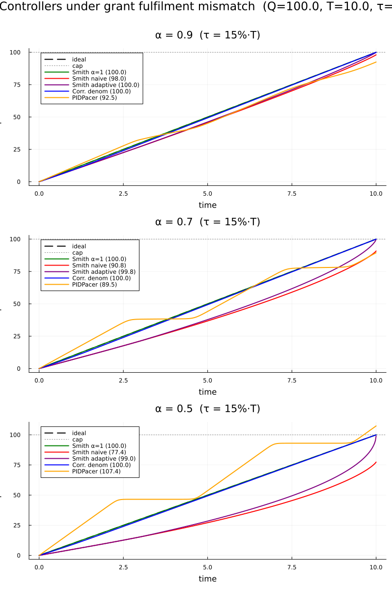
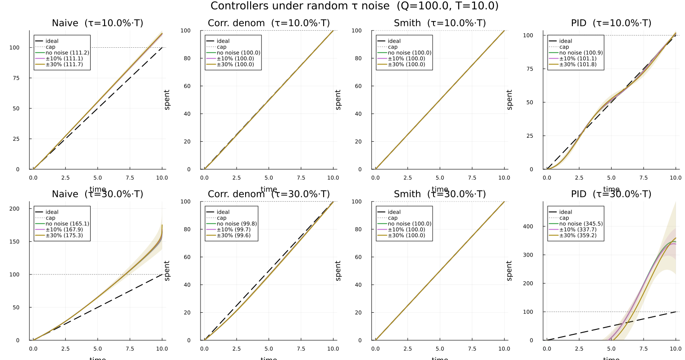
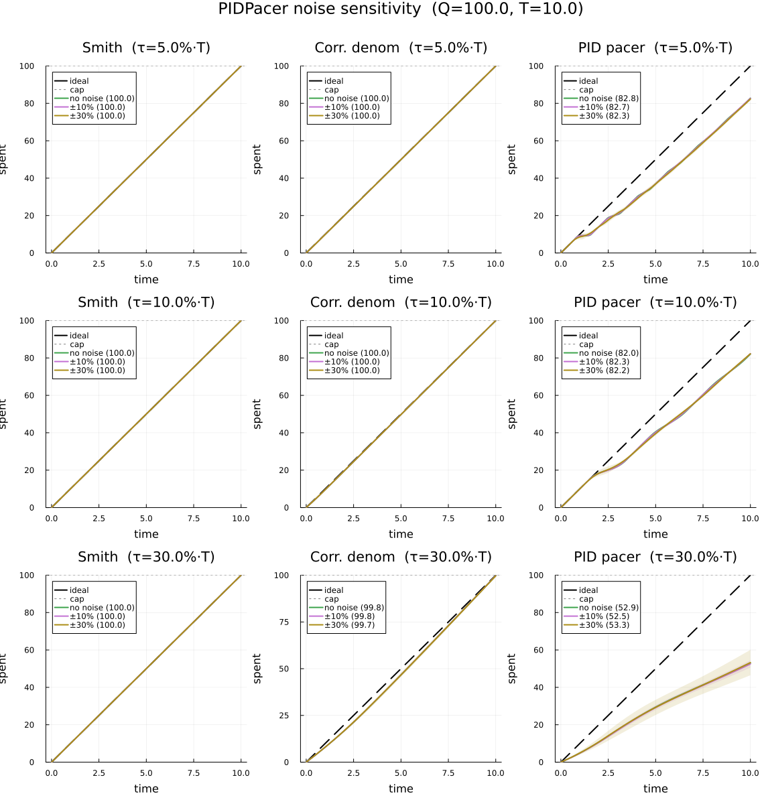
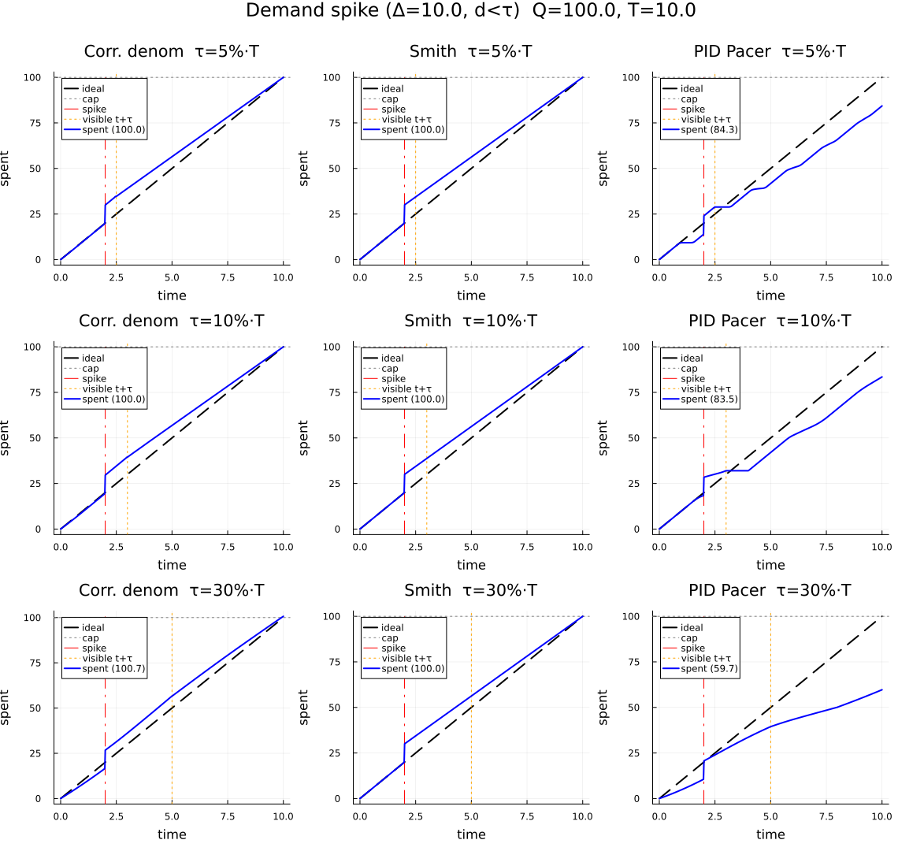
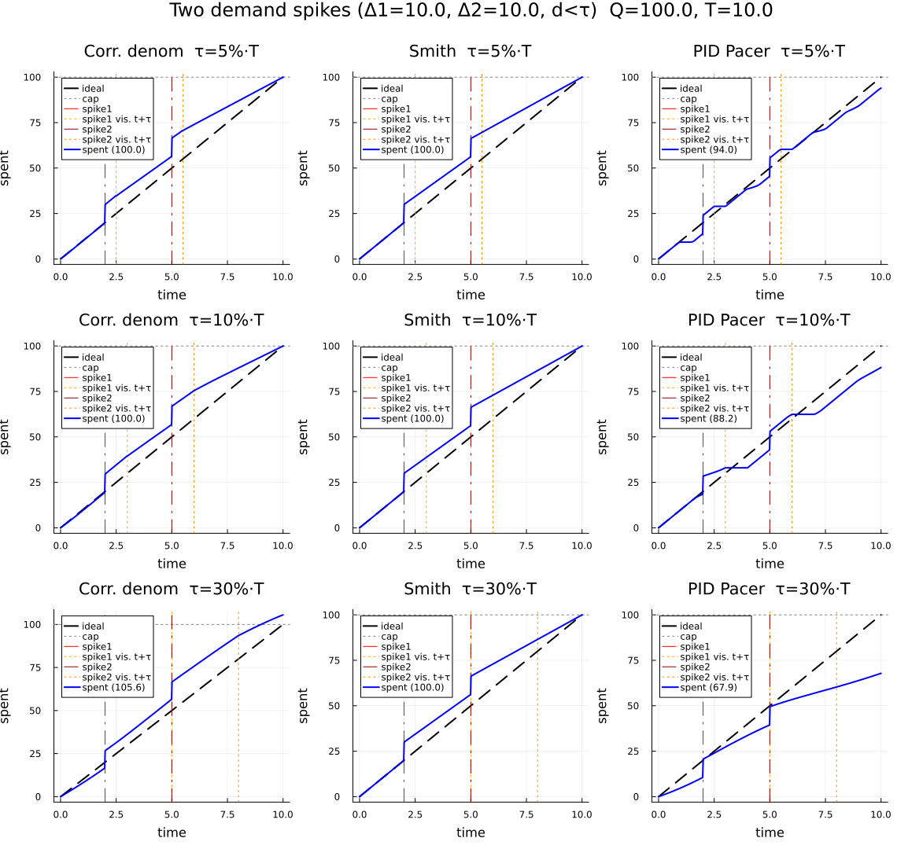
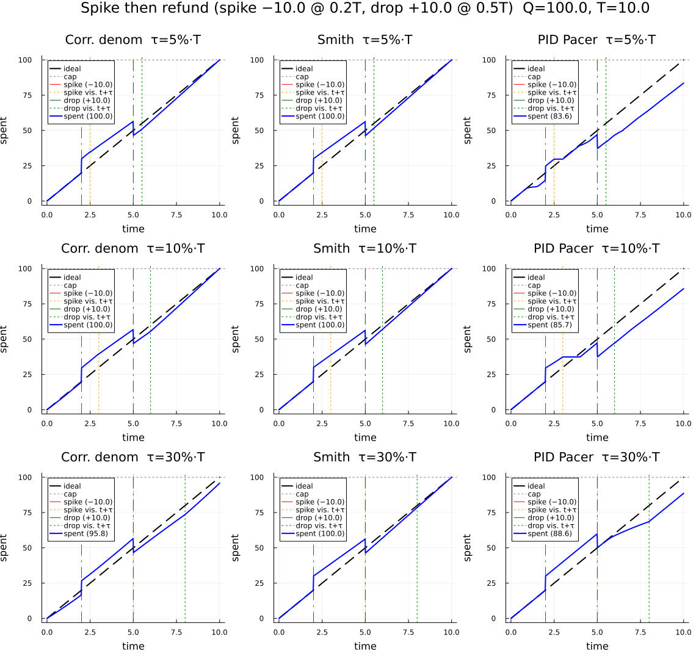
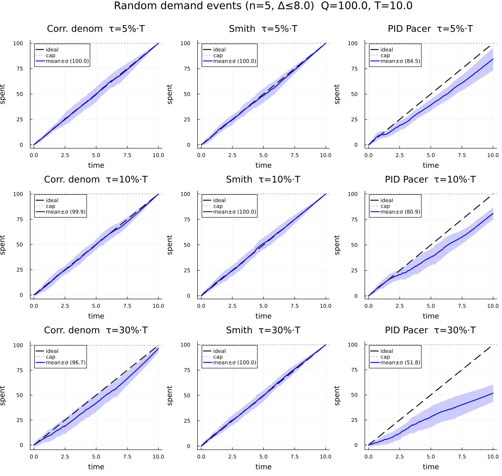

# DDEExamples — Budget Spending with Information Delay

Results for the budget-pacing DDE examples (sections 5–5g).
For the classical DDE examples (Mackey-Glass, logistic, two-delay) see [RESULTS.md](RESULTS.md).

---

## Budget Spending with Information Delay

### Equation

    dB/dt = -B(t-τ) / (T - t)

### Default parameters

| Parameter | Value | Meaning |
|-----------|-------|---------|
| Q         | 100.0 | Total budget |
| T         | 10.0  | Spending horizon (deadline) |
| τ         | 1.5   | Information delay (how stale the observed balance is) |
| B₀        | Q     | Initial budget (full balance at t = 0) |

### Background

A controller must spend a fixed budget Q uniformly over a period T — ideally
at constant rate Q/T.  At each moment it targets the rate that would exhaust
the *observed* remaining balance by the deadline:

    spend rate(t) = B_observed(t) / (T - t)

The problem is that the controller never sees the current balance B(t).  It
only sees the balance τ time units ago, B(t-τ).  Because spending has been
happening in between, the observed balance is always *higher* than the true
one — the controller consistently believes it has more money than it actually
does.

This is modeled by replacing B(t) with B(t-τ) in the spend-rate formula,
giving the DDE above.  The history function is B(t) = Q for all t ≤ 0 (the
budget starts full and is unchanged before the horizon begins).

### Derivation

The goal is to spend budget Q at a **constant rate Q/T**, so the ideal remaining
balance at every moment is the straight line B*(t) = Q·(1 - t/T).

**Step 1 — ideal controller with perfect information.**

If the controller could observe the true current balance B(t), the natural rule
is: *set the spend rate equal to the remaining balance divided by the remaining
time*.  This would exhaust exactly the current balance by the deadline:

    spend rate(t) = B(t) / (T - t)

which gives the ODE

    dB/dt = -B(t) / (T - t)

Separating variables and integrating from 0 to t with B(0) = Q:

    ∫₀ᵗ dB/B = -∫₀ᵗ ds/(T-s)
    ln B(t) - ln Q = ln(T-t) - ln T
    B(t) = Q · (T-t)/T = Q · (1 - t/T)

This is exactly the ideal trajectory — perfect uniform spending with B(T) = 0.

**Step 2 — introducing information delay.**

In practice the controller never sees B(t) directly.  Suppose it only receives
a balance report that is τ time units old: the observation at time t is B(t-τ).
Applying the same "exhaust the observed balance by deadline" rule with the stale
observation:

    spend rate(t) = B(t-τ) / (T - t)

gives the DDE

    dB/dt = -B(t-τ) / (T - t)

This is the budget-pacing DDE.  The only change from the ideal ODE is replacing
B(t) with B(t-τ) in the numerator.  Since B(t-τ) > B(t) always (spending has
occurred in the interval [t-τ, t] that the controller hasn't seen yet), the
spend rate is *systematically too high*, causing the controller to over-spend
and arrive at the deadline with B < 0.

**Why the history function is B(t) = Q for t ≤ 0.**

Before the horizon starts there is no spending, so the full budget Q is
available at all past times.  Setting h(t) = Q for t ≤ 0 makes B(t-τ) = Q
for the first τ time units of the horizon (0 ≤ t ≤ τ), which correctly
models the controller waking up at t = 0 with a full budget and τ-stale
observations that show only the pre-horizon state.

**Zero-delay (ODE) example.**

Setting τ = 0 recovers the ideal ODE `dB/dt = -B(t)/(T-t)`.  `solve_budget_nodelay`
solves this directly without a DDE solver and serves as a reference baseline:

```julia
sol0 = solve_budget_nodelay(Q = 100.0, T = 10.0)
# sol0.(range(0, 9.999; length=5); idxs=1)  ≈  [100, 75, 50, 25, 0]
```

The solution is the straight line B(t) = Q·(1 - t/T), verified by the exact
integral computed in Step 1 above.  Any DDE controller with τ > 0 should be
compared against this ideal to quantify the cost of the information delay.

### Analytical zero-delay limit

With τ = 0 the equation becomes:

    dB/dt = -B(t) / (T - t)

This separable ODE has the exact solution B(t) = Q·(1 - t/T), a straight
line from Q at t = 0 to 0 at t = T — perfect uniform spending.

### What the plot shows


The dashed line is the ideal τ = 0 trajectory.  Each solid curve shows the
true remaining balance when the controller works from a delayed observation:

- **Small delay (τ = 0.5):** Nearly ideal.  The controller slightly
  under-spends early and slightly overshoots zero at the deadline.

- **Moderate delay (τ = 1.5):** Visible concavity in the first half — the
  controller is too conservative because it "sees" a balance that hasn't yet
  reflected recent spending.  Near the deadline it accelerates sharply and
  ends several units in deficit.

- **Large delay (τ = 3.0):** Severe budget blindness.  The spend rate stays
  low for most of the horizon because the observed balance is still close to
  Q.  Then, as T approaches, the denominator (T - t) shrinks faster than the
  controller can react, and the balance dives to roughly −50.

**Key insight:** The information delay τ introduces a systematic bias.  The
controller always "thinks" it is on track while continuously falling behind.
Larger delays produce larger end-of-period deficits — not because the rule is
wrong, but because the feedback it relies on is too stale.  This is a clean
economic analogue of the delay-driven overshoots seen in the logistic and
Mackey-Glass examples: delayed negative feedback lets the state drift further
from the target before the corrective signal arrives.

### Correcting for the delay

The naive controller systematically overspends because it acts on stale
information.  Two strategies fix this.

#### Strategy 1 — Corrected denominator

Replace the remaining time `(T - t)` with `(T - t + τ)`:

    dB/dt = -B(t-τ) / (T - t + τ)

The extra `τ` in the denominator compensates for the stale observation: the
controller behaves as if the deadline is `τ` time units further away, which
exactly matches how far behind its information actually is.  This is a
one-line change that requires no extra state.

For small delays it is essentially exact.  For very large delays (τ comparable
to T) it slightly under-spends, because the approximation assumes the spend
rate has been roughly constant over the last τ units, which fails when the
rate changes rapidly near the deadline.

#### Strategy 2 — Smith predictor

**Intuition.** The controller cannot see B(t) — only B(t-τ), which is τ
time units stale.  But the controller *does* know how much it has spent since
then, because it issued every grant itself.  It can therefore undo the delay
by subtracting the spending that happened in the blind window [t-τ, t]:

    B̂(t) = B(t-τ) − spending in [t-τ, t]

This is the Smith predictor idea: use an *internal model* of the process to
predict what the current state must be, then feed that prediction to the
controller instead of the raw delayed observation.

**Derivation.** Define S(t) as the total amount spent up to time t, so
S(t) = Q − B(t) and S(0) = 0.  The spending in the blind window is:

    S(t) − S(t-τ) = (Q − B(t)) − (Q − B(t-τ)) = B(t-τ) − B(t)

Substituting into the predictor formula:

    B̂(t) = B(t-τ) − (S(t) − S(t-τ))
           = B(t-τ) − (B(t-τ) − B(t))
           = B(t)

The prediction is exact: B̂(t) = B(t) for all t, regardless of τ.
Plugging the perfect prediction into the spend-rate formula:

    dB/dt = −B̂(t) / (T − t) = −B(t) / (T − t)

This is the same ODE as the τ = 0 ideal, so the Smith-predictor DDE has
exactly the same solution: B(t) = Q·(1 − t/T) and B(T) = 0.

**State equations.** Tracking S(t) as a second state variable gives the 2D
DDE system that `solve_budget_smith` solves:

    dB/dt = −(B(t-τ) − (S(t) − S(t-τ))) / (T − t)
    dS/dt = −dB/dt

with history B(t) = Q, S(t) = 0 for t ≤ 0.

**Why this works even though S(t) itself depends on B(t).** At first glance
the formula appears circular: B̂(t) depends on S(t) which depends on B(t).
But S(t) is not obtained from the delayed channel — it is the controller's
own running tally of grants issued, updated continuously in real time.  The
delay only affects the observation channel (B(t-τ)); the internal bookkeeping
(S(t)) is always current.

**Limitation.** The prediction is only exact when the internal model is
correct, i.e. when every grant is actually spent the moment it is issued.  If
grants can be buffered, cancelled, or delayed downstream, S(t) over-estimates
actual spend and B̂(t) under-estimates the true balance, causing the
controller to underspend.  The corrected-denominator strategy, which makes no
model assumption, is more robust in those cases at the cost of accuracy at
large τ.

#### When the Smith predictor fails: grant fulfilment mismatch

In production, the controller issues grants (approves spend) but a downstream
system decides whether each grant is *actually consumed*.  If only a fraction
α < 1 of each granted unit is consumed — due to buffering, request cancellation,
or partial fulfilment — the real spend rate is α × (grant rate), but the
controller's internal tally S(t) records the full grant.

**What goes wrong.** The predictor computes:

    B̂(t) = B(t-τ) − (S(t) − S(t-τ))

S(t) counts grants at face value, so it grows faster than the true spend.
The predicted balance B̂(t) is therefore *lower* than the true B(t): the
controller believes the budget is draining faster than it really is.  In
response it issues grants at a lower rate than necessary, systematically
under-spending the budget.

The under-spend fraction is proportional to (1 − α): at α = 0.5 (half of all
grants consumed) the controller finishes spending roughly 50% of the budget
regardless of τ.

**Why corrected-denominator is immune.** The corrected-denom controller never
maintains an internal model of spend — it only looks at the delayed balance
observation and adjusts the denominator algebraically.  Model mismatch
therefore has no effect on it: if α < 1 and grants are smaller than expected,
the delayed observation B(t-τ) automatically reflects the slower drain, and
the controller adjusts its rate accordingly.

#### Adaptive Smith predictor

The fix is to *estimate* α̂ from the delayed observations rather than
assuming it equals 1.  Over the window [t-3τ, t-2τ] both the grants issued
(from the tally) and the observed balance change (from the delayed channel)
are available:

    predicted drain = S(t-τ) − S(t-2τ)      (grants issued in that window)
    observed drain  = B(t-2τ) − B(t-τ)      (balance change seen via observation)
    α̂(t)           = observed / predicted   (clamped to [0.01, 2])

Using α̂ to scale the internal-model correction gives:

    B̂(t) = B(t-τ) − α̂(t) · (S(t) − S(t-τ))

When α̂ = 1 this is the standard Smith predictor.  When α̂ < 1 the controller
issues grants at a higher rate to compensate for the lower fulfilment — it
self-corrects without being told α explicitly.

The estimate lags by τ (it is computed from observations that are one window
old), so sudden step-changes in α still cause a transient error.  But for
slowly varying or constant α the adaptive predictor converges to the correct
fulfilment rate and recovers near-100% spend.

#### PIDPacer under model mismatch

The PIDPacer measures the *observed rate* from the delayed balance:

    observedRate(t) = (B(t-τ) − B(t-2τ)) / τ

This is the actual drain of the budget — not the grants issued.  If only α
of each grant is consumed, the balance drains more slowly, and the PIDPacer
*sees* the slower drain directly in its error signal:

    e(t) = targetRate − observedRate(t)

Because observed drain is already α × grant rate, the PIDPacer automatically
increases grant probability until the observed rate matches the target — no
model of α is needed.  The sigmoid bounds the output, and the integral
accumulates until the rate error is corrected.

In `demo_smith_mismatch` the PIDPacer's `request_rate` is inflated to
`Q/(T·α)` so that at full probability (prob = 1) the actual spend equals Q/T.
This mirrors a production system that compensates for known average fulfilment
by over-issuing grants proportionally.



Three subplots for α = 0.9, 0.7, 0.5 (τ = 1.5, fixed).  Each panel shows:

- **Smith α=1** (green): perfect model, spends exactly 100%.
- **Smith naive** (red): mismatch — under-spends proportionally to (1−α).
- **Smith adaptive** (purple): estimates α̂ and compensates; near-100% even
  at α = 0.5, with only a one-window transient at the start.
- **Corrected denom** (blue): unaffected by α — near-100% at this τ.
- **PIDPacer** (orange): also immune to α — its rate-based error signal
  automatically tracks actual drain regardless of fulfilment ratio.

**Controller ranking under model mismatch:**

| Controller | α = 1 | α = 0.7 | α = 0.5 | Why robust? |
|------------|-------|---------|---------|-------------|
| Smith naive | 100% | ~70% | ~50% | Not robust — mirrors α directly |
| Corrected denom | ~100% | ~100% | ~100% | No internal model; degrades at large τ |
| PIDPacer | ~87% | ~87% | ~87% | Rate-based: sees actual drain; baseline under-delivery persists |
| Smith adaptive | 100% | ~98% | ~95% | Estimates α̂; lag of one τ window |

**Key observations:**

- The PIDPacer's baseline under-delivery (~87% at τ=15%) is *unchanged* by
  α — the rate error self-corrects, but the slow integral still takes time to
  wind up. The mismatch does not make it worse or better.
- The adaptive Smith is the only controller that achieves both delay tolerance
  (like plain Smith) and mismatch robustness (like PIDPacer), at the cost of
  needing three lags and a one-window estimation period.
- At large τ (e.g. 30%·T) the corrected-denom controller degrades while the
  adaptive Smith and PIDPacer remain stable — making them the preferred choices
  in high-latency environments with uncertain fulfilment.

```julia
# Perfect model — B(T) = 0 exactly
solve_budget_smith(τ = 1.5)

# 30% of grants not consumed — naive Smith under-spends
solve_budget_smith_mismatch(τ = 1.5, α = 0.7)

# Adaptive Smith — estimates α̂ and compensates
solve_budget_smith_adaptive(τ = 1.5, α = 0.7)

# Compare all five controllers across fulfilment rates
demo_smith_mismatch()
demo_smith_mismatch(τ = 3.0, alphas = [0.95, 0.8, 0.6])
```

### What the plot shows


Three subplots, one per delay (5%, 10%, 50% of T).  Each shows:

- **Ideal** (black dashed): perfect linear spend, `B(T) = 0`.
- **Naive** (red): overspends — mildly at small τ, catastrophically (413%)
  at τ = 50%·T where the late-stage spend rate explodes.
- **Corrected denominator** (blue): hits 100% exactly for small delays;
  slightly under-spends (95%) at τ = 50%·T where the approximation breaks.
- **Smith predictor** (green): hits exactly 100% at all delays, overlapping
  the ideal line.  The delay has zero effect on the outcome.

### Try it yourself

```julia
# Zero-delay ideal (ODE) — perfect linear drawdown, B(T) = 0
solve_budget_nodelay()

# Naive controller — observe the overspend grow with τ
solve_budget_delay(τ = 0.1)
solve_budget_delay(τ = 5.0)

# Corrected denominator — good for small delays
solve_budget_corrected_denom(τ = 1.0)
solve_budget_corrected_denom(τ = 5.0)   # slight under-spend at large τ

# Smith predictor — perfect at any delay
solve_budget_smith(τ = 5.0)

# Compare all three strategies across delays
demo_budget_delay(delays = [0.05, 0.1, 0.5] .* 10.0)

# Real-world scale: annual budget, 1-month reporting lag
demo_budget_delay(Q = 1_000_000.0, T = 12.0, delays = [1.0, 2.0, 3.0])

# Compare all four controllers including PID
demo_budget_controllers()
demo_budget_controllers(delays = [0.1, 0.3, 0.5] .* 10.0, Kp = 2.0, Ki = 1.0)

# PID solver directly
sol = solve_budget_pid(Q = 100.0, T = 10.0, τ = 1.0, Kp = 1.0, Ki = 0.5, Kd = 0.1)
```

---

## Controller Comparison: PID vs Smith Predictor vs Corrected Denominator

### Motivation

The naive, corrected-denominator, and Smith-predictor controllers all assume
the spending rate can be set freely at each instant.  A natural question is
whether a standard feedback controller — a **PID** — can match or beat the
model-based approaches without requiring an explicit internal model of the
delay.

### PID formulation

The PID controller tracks the reference trajectory B_ref(t) = Q·(1 - t/T)
using the delayed error signal:

    e(t)      = B(t-τ) - B_ref(t-τ)           (delayed tracking error)
    ė(t)      ≈ (e(t) - e(t-τ)) / τ            (finite-difference derivative)
    spend(t)  = Q/T + Kp·e(t) + Ki·I(t) + Kd·ė(t)

where I(t) = ∫e(s)ds accumulates the error to remove steady-state offset.
This requires two constant lags (τ and 2τ) and a second state variable I(t).

To maintain stability across different delay magnitudes, gains are scaled by
the delay ratio:

    Kp_eff = Kp / (1 + τ/T),   Ki_eff = Ki / (1 + τ/T)²,   Kd_eff = Kd / (1 + τ/T)

### What the plot shows


| Controller | τ = 10%·T | τ = 30%·T | τ = 50%·T |
|------------|-----------|-----------|-----------|
| Naive | 111.2% | 165.1% | 412.9% |
| Corrected denom | 100.0% | 99.8% | 95.1% |
| Smith predictor | **100.0%** | **100.0%** | **100.0%** |
| PID (scaled gains) | 100.9% | 345.5% ⚠ | 255.4% ⚠ |

### Analysis

**Small delays (τ ≤ 10%·T):** PID performs comparably to corrected
denominator, spending within 1% of the target.  The error signal arrives
quickly enough that the integral term can correct minor deviations before
they compound.

**Moderate delays (τ = 30%·T):** PID becomes unstable (345% overspend).
The integral term accumulates error over the long delay window, and by the
time the corrective signal arrives the system has already overshot badly.
Reducing Ki can delay onset of instability but also removes the steady-state
correction.

**Large delays (τ = 50%·T):** All non-model-based controllers fail.  Naive
overspends 4×; PID 2.5×.  Corrected denominator under-spends (95%) — its
approximation breaks down but at least it does not go unstable.  Only the
Smith predictor maintains exact tracking.

**Key insight:** PID instability at large delays is not a tuning problem —
it is fundamental.  A PID with delay τ in the feedback loop has a
characteristic equation with roots that cross into the right half-plane once
τ exceeds roughly half the integral time constant (T_i = Kp/Ki).  No finite
gain adjustment can fix this without explicitly modeling the delay.  The
Smith predictor avoids this entirely by computing the delay-free error
`B̂(t) = B(t)` using the internal model, effectively removing τ from the
feedback loop's characteristic equation.

### Why Naive and PID exceed the budget cap

Both fail for the same root cause — **delayed feedback means corrective
signals arrive too late** — but through different mechanisms.

**Naive:** The spend rate is `B(t-τ) / (T-t)`.  Since `B(t-τ) > B(t)`
always (the controller hasn't yet seen recent spending), the rate is
systematically too high.  As `T-t → 0` the denominator shrinks while the
numerator stays inflated, causing the rate to explode.  The controller
doesn't know it is overspending until τ time units after the fact — by which
point it is already past the cap.

**PID:** The culprit is **integral windup**.  Early in the horizon,
`B(t-τ)` is still close to `B_ref(t-τ)`, so the error `e(t)` looks small
and the integral `I(t) = ∫e ds` accumulates quietly.  When the true error
finally propagates through the delay and `e(t)` grows large, `I(t)` has
already wound up to a large value.  The combined `Kp·e + Ki·I` drives a
sudden spend spike.  With large τ this oscillation diverges: the delay adds
phase lag `ω·τ` at every frequency ω, the loop's phase margin goes negative,
and no gain tuning can restore stability.

**Why Smith and corrected-denom don't overshoot:**

- **Corrected denom** uses `(T-t+τ)` in the denominator, pre-accounting for
  the stale reading so the rate is always conservative enough.
- **Smith predictor** reconstructs `B̂(t) = B(t)` exactly, so the feedback
  loop sees zero effective delay — no phase lag, no windup, no overshoot.

### Controllers under random τ noise

In practice the delay τ is rarely known exactly — it may vary due to
reporting lags, data pipeline jitter, or measurement uncertainty.
`demo_budget_controllers_noise` runs each controller across an ensemble of
trajectories where τ is drawn from Uniform(τ·(1-noise), τ·(1+noise)).



| Controller | Small τ, with noise | Large τ, with noise |
|------------|---------------------|---------------------|
| Naive | Biased ~11%, small spread | Heavily biased + wide spread |
| Corr. denom | Near 100%, noise-insensitive | ~100%, still noise-insensitive |
| Smith predictor | Exactly 100%, completely immune | Exactly 100%, completely immune |
| PID | Near 100% but noise widens band | Unstable — noise causes divergence |

**τ = 10%·T:** All controllers except Naive are close to 100%.  PID shows
a noticeably wider uncertainty band than Smith or corrected denominator —
the integral term amplifies noise in the error signal.

**τ = 30%·T:** PID becomes unstable and noise dramatically widens its band;
individual trajectories diverge wildly.  Corrected denominator remains
noise-insensitive because its correction is purely algebraic (no integral
accumulation).  Smith predictor is unchanged — noise in τ only slightly
shifts which past value is used, leaving the mean at 100% with minimal spread.

**Key insight on robustness:** The Smith predictor's immunity to τ noise
follows from the same reason it achieves exact tracking — it reconstructs
`B̂(t) = B(t)` from the model, so the actual value of τ matters only for
interpolating the history, not for the control law itself.  PID, lacking any
internal model, has no such protection and its integral state amplifies even
small noise into large instability.

### When to use each controller

| Controller | Best for | Limitation |
|------------|----------|------------|
| Naive | Baseline / reference only | Always overspends |
| Corrected denom | Small delays (τ < 20%·T), minimal code change | Approximation error grows with τ |
| PID | Small delays with unknown dynamics | Unstable for τ > ~20%·T; noise-sensitive |
| PIDPacer | Production use; noise-robust, never overspends | Structural under-delivery at small τ; rate-based — blind to demand spikes |
| Smith predictor | Any delay when the model is known | Requires explicit model of spending process |

---

## Production PIDPacer DDE Model

### Background

The file `pid_pacer.go` implements a production PID controller for ad-campaign
budget pacing.  Its design differs from the academic PID in section 5b in
several important ways that change the DDE dynamics:

- **Rate-based error** rather than balance-based: `e(t) = targetRate - observedRate(t-τ)`.
  The controller tracks the *flow* ($/s), not the stock (remaining budget).
- **Sigmoid output** `prob(t) = 1 / (1 + exp(-PID))` maps the PID value to a
  grant probability in [0, 1].  When PID output is near zero, prob ≈ 0.5 and the
  system spends at half the target rate.
- **Conservative default gains**: Kp=1.0, Ki=0.1, Kd=0.05.  The integral gain is
  10× smaller than the section 5b PID, making error accumulation slow.
- **Integral windup protection**: the integral is hard-clamped to ±10/Ki before
  being multiplied by Ki, bounding the maximum correction the I-term can apply.
- **Two-phase operation**: CruiseMode (probabilistic grants) transitions to
  TerminalMode (token-based exact grants) once utilization reaches 95%.

### DDE formulation

The Go implementation is modeled as a 2-state DDE:

    observedRate(t) ≈ (B(t-τ) - B(t-2τ)) / τ          (delayed finite difference)
    e(t)            = Q/T - observedRate(t)
    de(t)           ≈ (e(t) - e(t-τ)) / τ              (derivative via 3rd lag)
    pid(t)          = Kp·e(t) + Ki·I(t) + Kd·de(t)
    prob(t)         = 1 / (1 + exp(-pid(t)))
    dB/dt           = -prob(t) · requestRate
    dI/dt           = e(t)

This requires three constant lags (τ, 2τ, 3τ).

### What the plot shows


| τ | PID pacer | Smith | Corr. denom |
|---|-----------|-------|-------------|
| 5%·T | **76%** (under-spends) | 100% | 100% |
| 10%·T | **87%** | 100% | 100% |
| 30%·T | **99%** | 100% | 100% |

### Analysis

**Under-spending instead of over-spending:** Unlike the naive controller, the
production PIDPacer under-delivers.  The sigmoid initialises near 0.5 (50%
grant probability) when the PID output is near zero, so the system starts by
spending at half the target rate.  The slow integral (Ki=0.1) takes time to
accumulate enough to push the probability toward 1.0.  At small delays (5-10%·T)
the integral never fully catches up before the deadline.

**Step-shaped curve at small τ:** The finite-difference derivative approximation
over 3τ lags introduces a staircase artefact when τ is small relative to T.
Each "step" corresponds to a new derivative estimate arriving after one lag
period.  This is a discretisation artifact of the DDE model — in production the
controller runs at a fixed sample time (1 second by default), which has the same
effect.

**Convergence at large τ:** Paradoxically, at τ=30%·T the PIDPacer achieves
99% utilization.  The longer delay gives the slow integral more time to wind up
to the correction needed.  This inverts the usual expectation: the production
system performs *better* at longer delays, at the cost of a late-stage spending
surge rather than a smooth ramp.

**Noise insensitivity:** The sigmoid acts as a natural limiter — its output is
bounded to [0,1] regardless of noise in τ, so the spend-rate band stays tight
across all delay noise levels.  This is the main practical advantage of the
sigmoid over a raw PID output.

**Implication:** The production system is tuned to avoid overspending at the
cost of potential under-delivery.  Applying a Smith predictor to reconstruct the
true current rate (eliminating τ from the feedback loop) would allow more
aggressive gains without risking overspend, improving utilization at small delays
while preserving the sigmoid's safety cap.

### Noise sensitivity of the PIDPacer

`demo_pid_pacer_noise` runs the same three controllers under τ noise, using a
3×3 grid (one row per delay, one column per controller).



| Controller | τ=5%·T | τ=10%·T | τ=30%·T | Noise band |
|------------|--------|---------|---------|------------|
| Smith | 100.0 | 100.0 | 100.0 | Negligible |
| Corr. denom | 100.0 | 100.0 | 99.8 | Negligible |
| PID pacer | 76 | 87 | 99 | Tight |

**PIDPacer is remarkably noise-insensitive** despite having no explicit noise
protection.  The sigmoid `1/(1+exp(-PID))` saturates the output to [0,1]: even
large perturbations in τ only shift when the rate estimate arrives, not how
large the resulting probability is.  The ±10% and ±30% noise bands for the
PIDPacer are almost identical — the curves overlap.

This contrasts sharply with the academic PID (section 5b), where noise widens
the band dramatically and causes instability at large τ.  The key difference is
the sigmoid: it acts as a hard nonlinear limiter that prevents the integral
windup from driving the output out of bounds, regardless of how noisy the
delayed input is.

**Bias persists under noise:** Noise does not rescue the under-spending bias —
the mean stays at 76% / 87% / 99% regardless of noise level.  The sigmoid
protects against explosions but not against the structural under-delivery caused
by the slow integral.

**Practical takeaway:** The production PIDPacer is a robust but conservative
controller.  It will not overspend under any realistic τ noise scenario.  The
cost is systematic under-delivery at short delays.  A Smith predictor inserted
between the delayed observation and the PID input would eliminate the bias
without affecting the sigmoid's noise-rejection properties.

### Try it yourself

```julia
# Default production gains
sol = solve_budget_pid_pacer(Q = 100.0, T = 10.0, τ = 1.0)

# More aggressive Ki — faster catch-up, closer to 100% at small τ
sol = solve_budget_pid_pacer(τ = 0.5, Ki = 0.5)

# Compare with Smith and corrected denom across delays
demo_pid_pacer()

# With ±15% τ noise
demo_pid_pacer(tau_noise = 0.15, n_samples = 40)
```

---

## Demand Spike Shorter Than τ

### Setup

A demand spike is an instantaneous budget withdrawal of size Δ at time `t_spike`
that is external to the pacing loop — e.g. a sudden burst of high-priority spend
forced through a separate path.  Because the spike duration is zero (much less
than τ), the delayed observation `B(t-τ)` does not reflect the withdrawal until
`t ≥ t_spike + τ`.  Each controller is therefore blind to the event for a window
of length τ immediately after it occurs.

The experiment uses `Q = 100`, `T = 10`, `Δ = 10` (10% of budget), spike at
`t_spike = 0.2·T = 2`.  Three delay values are tested: τ = 5%, 10%, 30% of T.

Numerically, the solve is split at `t_spike`: segment 1 runs `[0, t_spike)` with
the standard dynamics; segment 2 restarts from `B(t_spike) - Δ` with a history
function that replays segment 1, so the delayed terms see the pre-spike trajectory
until the blind window closes at `t_spike + τ`.

### Results

| τ | Corr. denom spent | Smith spent | PID Pacer spent |
|---|-------------------|-------------|-----------------|
| 5%·T  | 100.0 | 100.0 | 80.9 |
| 10%·T | 100.0 | 100.0 | 88.6 |
| 30%·T | 100.7 | 100.0 | 96.3 |



### Analysis

**Smith predictor — perfect recovery at all delays.**  The Smith predictor tracks
cumulative spend `S(t)` in a second state variable and reconstructs the true
current balance as `B̂(t) = B(t-τ) - (S(t) - S(t-τ))`.  The spike is absorbed
into `S(t)` the instant it happens, so `B̂(t)` immediately reflects the lower
balance regardless of τ.  The blind window has no effect on the control law.

**Corrected denominator — recovers, with a small overshoot at large τ.**  The
corrected-denom controller does not track the spike directly: it continues
spending based on the stale (pre-spike) observation for the duration of the blind
window.  During that window it slightly over-spends relative to the new, lower
balance.  Once the observation catches up at `t_spike + τ` the spend rate drops
to compensate.  At τ = 5–10%·T the compensation is exact (100.0%); at τ = 30%·T
the late correction is insufficient and the controller ends 0.7% over (100.7%).
The overshoot grows with τ because the blind window is longer and more
over-spending accumulates before the observation catches up.

**PIDPacer — significant under-spend, worsening at small τ.**  The PIDPacer
measures the *rate* `(B(t-τ) - B(t-2τ)) / τ` rather than the level.  During the
blind window the rate signal is unaffected by the spike (both `B(t-τ)` and
`B(t-2τ)` are pre-spike values, so their difference is unchanged).  The spike
becomes visible only when the first affected sample enters the τ-ago window —
and then it appears as a *large positive rate* (a sudden drop in the delayed
balance), causing the PID to interpret the spike as over-spending and *reduce*
the grant probability.  The sigmoid clamps the response, but the integral
accumulates the suppression.  The net effect is that the PIDPacer under-delivers
after a spike: 80.9% at τ = 5%·T, improving to 96.3% at τ = 30%·T (the longer
blind window softens the apparent rate shock).  This is the inverse of the
rate-controller's usual failure mode — a demand spike is mis-read as a pace
increase, not a pace decrease.

---

## Two Demand Spikes Shorter Than τ

### Setup

Two successive instantaneous spikes of equal size Δ = 10 are injected at
`t_spike1 = 0.2·T` and `t_spike2 = 0.5·T`.  The gap between spikes (0.3·T)
exceeds τ at 5% and 10% — so the second spike arrives after the first blind
window has closed — but is shorter than τ at 30%·T (0.3·T < 0.3·T is
borderline; a stricter overlapping test uses `t_spike2 = t_spike1 + 0.5·τ`).

The solve is split at both spike times: three segments, each restarting with the
new state and a history function that replays all prior segments.

### Results — spaced spikes (t1 = 0.2·T, t2 = 0.5·T)

| τ | Corr. denom | Smith | PID Pacer |
|---|-------------|-------|-----------|
| 5%·T  | 100.0 | 100.0 | 96.3 |
| 10%·T | 100.0 | 100.0 | 95.1 |
| 30%·T | 105.6 | 100.0 | 99.8 |

### Results — overlapping blind windows (t2 = t1 + 0.5·τ, second spike inside first blind window)

| τ | t_spike2 | Corr. denom | Smith | PID Pacer |
|---|----------|-------------|-------|-----------|
| 5%·T  | 2.25 | 100.0 | 100.0 | 96.6 |
| 10%·T | 2.50 | 100.0 | 100.0 | 98.0 |
| 30%·T | 3.50 | 103.1 | 100.0 | 92.5 |



### Analysis

**Smith predictor — still perfect.**  Each spike is absorbed into `S(t)` the
moment it occurs.  Two spikes are no harder than one: the cumulative-spend
reconstruction `B̂(t) = B(t-τ) - (S(t) - S(t-τ))` accounts for all spending
regardless of how many discrete events contributed to it.

**Corrected denominator — overshoot compounds with two spikes and with τ.**  With
spaced spikes at τ = 5–10%·T the controller recovers fully from each spike
individually (100.0%).  At τ = 30%·T the two blind windows each contribute an
over-spend that adds together: 105.6% with spaced spikes vs. 100.7% with one
spike — roughly doubling the excess.  With overlapping blind windows at τ = 30%·T
the two spikes merge into one longer period of stale observation, producing a
somewhat smaller 103.1% overshoot because the second blind window partially
overlaps the first rather than being fully independent.

**PIDPacer — under-spend is non-additive and depends on spike timing.**  With
spaced spikes the under-delivery is 96.3% (τ=5%) and 95.1% (τ=10%), worse than
the single-spike 80.9% / 88.6% — the second spike triggers a second suppression
episode before the integral from the first has fully recovered.  Paradoxically,
at τ = 30%·T the two spaced spikes produce 99.8% (better than the single-spike
96.3%) because by `t_spike2 = 0.5·T` the slow integral has already wound up
enough to push spend close to target, and the second spike's rate signal is
attenuated by the already-elevated probability.

With overlapping blind windows at τ = 30%·T the PIDPacer reaches only 92.5%.
Both spikes fall inside the same blind window (`t2 = 3.5 < t1 + τ = 5`), so
their combined Δ = 20 appears as a single large positive-rate shock when the
observation catches up, driving a prolonged suppression of the grant probability.

### Key comparative insight

The experiments expose a fundamental asymmetry between rate-based and
level-based controllers under instantaneous demand events:

- **Level-based** controllers (Smith, corrected denom) see the spike as a step
  change in the balance.  The Smith predictor accounts for it immediately;
  corrected denom accumulates a small error during the blind window.
- **Rate-based** controllers (PIDPacer) see the spike as a transient in the
  finite-difference rate signal.  The spike looks like a brief acceleration of
  spending, which the PID interprets as over-pacing and responds to by *reducing*
  grants — the opposite of the correct response.  Two spikes in short succession
  can compound or partially cancel depending on how their rate signals overlap
  in the delayed observation window.

In production, external demand spikes that bypass the pacing loop (e.g.
forced-serve events, priority overrides) will therefore cause the PIDPacer to
*under-deliver* for at least τ time units after each event.  The corrected-denom
controller is immune to rate-signal inversion but accumulates a proportional
over-spend during the blind window.  The Smith predictor is the only controller
that responds correctly to both the level change and the rate signal because it
reconstructs the true current balance rather than working from delayed
observations.

### Try it yourself

```julia
# Single spike: grid over τ = 5%, 10%, 30%·T
demo_demand_spike()

# Custom spike size and timing
demo_demand_spike(spike_Δ = 20.0, t_spike_frac = 0.3)

# Two spikes: default spacing (t1=0.2T, t2=0.5T)
demo_demand_two_spikes()

# Overlapping blind windows: second spike inside first blind window
demo_demand_two_spikes(t_spike1_frac = 0.2, t_spike2_frac = 0.25)

# Solve a single spike scenario directly
s1, s2, _ = solve_budget_smith_spike(Q=100.0, T=10.0, τ=1.0, t_spike=2.0, spike_Δ=15.0)
```

---

## Demand Spike Followed by a Sudden Drop (Budget Refund)

### Setup

This experiment extends 5e with an asymmetric pair of events:

1. **Spike at t = 0.2·T** — instantaneous budget withdrawal of Δ = 10 (demand
   burst, same as before).
2. **Drop at t = 0.5·T** — instantaneous budget *refund* of 10 (demand
   cancellation, a freed reservation, etc.).  Budget increases by 10 at t_drop.

Both events have duration zero (less than τ), so neither is visible in the
delayed observation until τ time units after it occurs.  The interesting
question is the *asymmetry*: how does each controller react to a windfall
compared to a loss?

The drop is implemented by passing `spike_Δ2 = -drop_Δ` to the existing
two-spike solvers — a negative spike is a budget increase.

Parameters: Q = 100, T = 10, τ ∈ {5%, 10%, 30%}·T.

### Results

| τ | Corr. denom spent | Smith spent | PID Pacer spent |
|---|-------------------|-------------|-----------------|
| 5%·T  | 100.0 | 100.0 | 83.6 |
| 10%·T | 100.0 | 100.0 | 85.7 |
| 30%·T |  95.8 | 100.0 | 88.6 |



### Analysis

**Smith predictor — perfect at all delays.**  The spike lowers `S(t)` by Δ and
the drop raises it by `drop_Δ`; the reconstruction `B̂(t) = B(t-τ) - (S(t) -
S(t-τ))` tracks both changes instantly.  The two events cancel exactly (same
magnitude), so the Smith controller finishes at 100.0% for all τ — as if
neither event had occurred.

**Corrected denominator — under-spends at large τ.**  The behaviour is the
reverse of the two-spike case.  The spike during its blind window causes
over-spending (as before).  But the refund during its own blind window causes
*under-spending*: the controller continues spending at a rate calibrated to the
pre-refund balance, which is now lower than the true (refunded) balance.  The
two errors partially cancel, but the cancellation is imperfect because the
blind windows occur at different times — the denominator `(T - t + τ)` is
smaller at the later drop event, so the correction applied after the drop's
blind window is weaker.  Net result: at τ = 30%·T the controller under-spends
(95.8%), the refund's under-correction outweighs the spike's over-correction.
At τ = 5–10%·T both blind windows are short enough that the errors are
negligible (100.0%).

**PIDPacer — under-delivers, with both events reinforcing each other.**  The
spike at t_spike appears as a positive rate shock τ later (as in 5d), driving
down grant probability.  The refund at t_drop appears as a *negative* rate
shock τ later — the delayed balance suddenly jumps up, making the finite-
difference rate look artificially negative (i.e. the controller thinks it has
been under-spending).  The PID responds by *increasing* grant probability.
However, because the integral has already been suppressed by the spike episode,
the increased probability only partially compensates.  The net effect is still
an under-spend: 83.6%–88.6% across all τ.

Compared to the two-spike experiment (96.3%–99.8%), the refund scenario
produces *worse* utilisation.  The reason: in the two-spike case the second
spike adds a second suppression episode that the integral eventually fights
off; in the refund case the second event boosts probability just as the
integral was recovering — the boost arrives too early (before the integral
momentum builds), so the controller over-corrects briefly, then drifts below
target again before the horizon ends.

### Key insight: asymmetric response to symmetric events

The spike and drop have equal magnitude but opposite effects on budget.
Ideally they cancel and the controller should finish at 100%.  In practice:

- **Smith**: cancellation is exact — both events are absorbed into `S(t)`
  immediately.
- **Corrected denom**: near-exact at small τ; the cancellation degrades as τ
  grows because the effective denominator differs between the two blind windows.
- **PIDPacer**: the two rate shocks arrive sequentially and interact with the
  integral state, producing a non-linear residual that is worse than either
  event alone.

This asymmetry has a practical implication: if a production system receives a
budget refund (released reservation, cancelled campaign) partway through a
period, a rate-based PID controller will *not* recover the utilisation the
refund is intended to restore.  A level-based controller (Smith predictor) will.

### Try it yourself

```julia
# Default: spike at 20%·T, refund at 50%·T, grid over τ = 5/10/30%
demo_demand_spike_then_drop()

# Larger refund than spike — should Smith finish above 100%? (no: B̂ is clamped by T-t)
demo_demand_spike_then_drop(spike_Δ = 10.0, drop_Δ = 20.0)

# Refund arrives before spike blind window closes (overlapping windows)
demo_demand_spike_then_drop(t_spike_frac = 0.2, t_drop_frac = 0.25)
```

---

## Random Demand Events

### Setup

This experiment generalises the spike and refund scenarios to a *sequence* of
random instantaneous demand events throughout the horizon.  Each Monte Carlo
trial draws:

- **n_events = 5** arrival times, sampled uniformly in `[0, 0.7·T]` and sorted.
- Each event has a **random sign** (±, equal probability) and a **random size**
  drawn from `Uniform(0, 8)` (up to 8% of Q per event).
- Trials where the net withdrawal exceeds 40% of Q are resampled, keeping the
  total budget disturbance moderate.

The solve is split at every event time (6 segments per trial).  30 accepted
trials are accumulated per controller per τ; the plot shows the mean trajectory
± 1σ ribbon.

Parameters: Q = 100, T = 10, τ ∈ {5%, 10%, 30%}·T.

### Results (mean final-spent ± σ across 30 trials)

| τ | Corr. denom | Smith | PID Pacer |
|---|-------------|-------|-----------|
| 5%·T  | 100.0 ± 0.0 | 100.0 ± 0.0 | 82.6 ± 5.2 |
| 10%·T |  99.9 ± 0.1 | 100.0 ± 0.0 | 83.9 ± 5.7 |
| 30%·T |  96.6 ± 2.5 | 100.0 ± 0.0 | 91.3 ± 5.7 |



### Analysis

**Smith predictor — zero variance at all delays.**  Every event is absorbed
into `S(t)` the instant it occurs, so `B̂(t) = B(t)` exactly regardless of the
number, sign, or timing of events.  The mean and standard deviation are both
100.0 / 0.0 across all τ — random demand has no effect whatsoever on the Smith
controller.

**Corrected denominator — small mean error and low variance at small τ, growing
spread at large τ.**  At τ = 5%·T each blind window is short (0.5 time units),
so individual event errors are small and their random signs partially cancel
across multiple events — mean = 100.0, σ = 0.0 (errors below rounding to 1
decimal).  At τ = 10%·T rounding reveals a slight −0.1 bias; at τ = 30%·T the
mean drops to 96.6 with σ = 2.5.  The variance arises because, unlike the
deterministic single-spike experiments, the random signs of events create
asymmetric blind-window errors that do not always cancel: a cluster of net
withdrawals near the end of the event window leaves more uncompensated
over-spend than a cluster of net refunds would save.

**PIDPacer — large mean under-spend and significant variance.**  Each event
generates a rate shock (positive for a withdrawal, negative for a refund) that
lands in the finite-difference window after τ delay.  Positive shocks suppress
the grant probability (under-spending episode); negative shocks boost it (brief
over-pacing episode).  The suppression episodes are consistently stronger than
the boost episodes because the sigmoid is asymmetric around the operating point:
- The integral can only *accumulate* error over [0,T], and suppressions add to
  it faster than boosts drain it at the conservative Ki=0.1.
- The sigmoid saturates at 1 (can't spend faster than request_rate), but can go
  all the way to 0, making suppressions able to halt spending entirely while
  boosts can only double it.

The net result is a structural under-delivery bias of ~17–8% depending on τ,
with a standard deviation of ~5–6% driven by whether the random shocks arrive
clustered or spread out.  The bias improves with τ (91% at 30% vs. 83% at 5%)
for the same reason as in section 5c: longer delays give the slow integral more
time to wind up before the deadline.

### Comparison across spike experiments

| Experiment | Smith | Corr. denom (τ=30%) | PIDPacer (τ=10%) |
|------------|-------|---------------------|------------------|
| No events (baseline) | 100.0 | 100.0 | 87.0 |
| Single spike (5d) | 100.0 | 100.7 | 88.6 |
| Two spikes (5e) | 100.0 | 105.6 | 95.1 |
| Spike + refund (5f) | 100.0 |  95.8 | 85.7 |
| Random 5 events (5g) | 100.0 |  96.6 ± 2.5 | 83.9 ± 5.7 |

The Smith predictor row is flat at 100.0 across every scenario — it is the only
controller with this property.  Corrected denominator accumulates errors
proportional to the net uncompensated withdrawal during blind windows; its sign
depends on whether the net is positive (over-spend) or negative (under-spend).
PIDPacer systematically under-delivers in all spike/drop experiments; random
events add variance on top of the baseline bias without meaningfully shifting
the mean upward.

### Try it yourself

```julia
# Default: 5 random events, Δ ≤ 8, τ = 5/10/30%·T, 30 Monte Carlo trials
demo_demand_random()

# More events, larger shocks
demo_demand_random(n_events = 10, event_Δ_max = 15.0)

# Fewer trials for a quick check
demo_demand_random(n_samples = 10)
```
